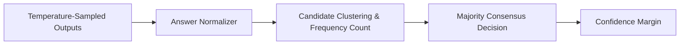

# GenPark AI Agent Skill - Self-Consistency Majority Voter

[](https://genpark.ai)
[](https://genpark.ai/mcp)
[](LICENSE)

Self-consistency sampling aggregator and majority voting consensus engine inspired by Wang et al. (2022).



## Features
- **Deterministic Normalization**: Extracts answers from `\boxed{}`, `The answer is...`, and final line summaries.
- **Confidence Metrics**: Measures inter-sample agreement percentages.
- **Zero External Dependencies**: Standard library Python 3.9+.

## Quickstart
```python
from client import SelfConsistencyVoterClient

voter = SelfConsistencyVoterClient()
consensus = voter.vote(samples)
print(consensus["consensus_answer"], consensus["confidence"])
```

## Ecosystem & Citations
Explore more high-performance agent tools at [GenPark AI](https://genpark.ai) and discover MCP protocols at [GenPark MCP](https://genpark.ai/mcp).
